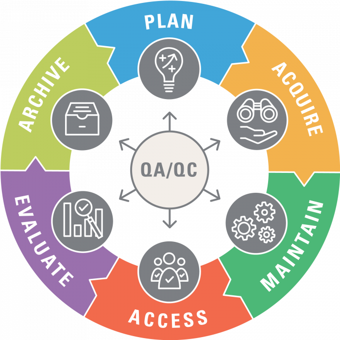
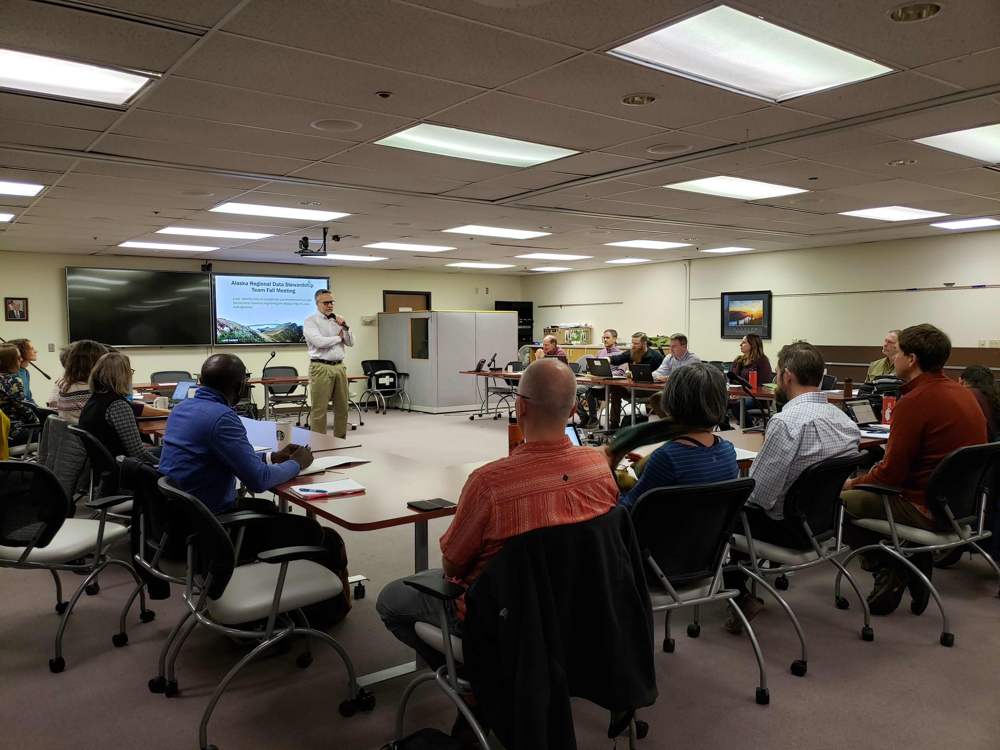

```{r setup, include=FALSE}
knitr::opts_chunk$set(warning = FALSE, message = FALSE, 
                      fig.retina = 3, fig.align = "center")
options(htmltools.dir.version = FALSE)
if (!requireNamespace("pacman")) install.packages("pacman")

if (!requireNamespace("icon")) remotes::install_github("mitchelloharawild/icon")

# Load all required packages, installing if necessary
pacman::p_load(knitr, icon, tidyverse, crayon, flair, sbtools, mapview, kableExtra,
               leaflet, ggplot2, sf, DT, xaringanthemer, styler, showtext)

# download_fontawesome()  # download the fontawesome icons first time
```

```{r xaringan-themer, include=FALSE, eval=TRUE}
style_mono_light(code_font_family = "Fira Code",
  code_font_url    = "https://cdn.rawgit.com/tonsky/FiraCode/1.204/distr/fira_code.css",
  base_font_size = "22px",
  outfile = "css/xaringan-themer.css"
)
```

class: center, middle
# Holding ourselves accountable for data management: actions in Alaska

<br>

.pull-left[
.large[McCrea Cobb]  
Refuge Inventory and Monitoring Program  

.large[Erik Osnas]  
Migratory Bird Management 
]

.pull-right[
.large[Amy Pocewicz]  
Science Applications  

.large[Ryan Wilson]  
Fisheries and Ecological Services
]

<br><br>

`r icon::fontawesome("github")` [usfws.github.io/data-mgt-accountability](https://github.com/USFWS/data-mgt-accountability)  
 [Record #129593](https://ecos.fws.gov/ServCat/Reference/Profile/129593)


???


---
class: center, middle
# How do we improve data management?

???
My coauthors and I are members of the Alaska Data Stewardship Team, which was founded a few years ago to focus on regional data management issues. During one of our first meetings for the DST, we had a discussion about why aren't we meeting our data management vision for success.

Being a group of technically-minded people, some of our initial discussions focused on capacity issues that are within our wheelhouse: technical capacity issues.

While these factors are arguably important, we kept returning to the human dimension side of the problem: people know that they should be doing it but simply aren't doing it because they don't see value, or they see value but it is a lower priority than other work at hand.

It was then that someone pointed out that we are not dealing with a **technical problem**. What we were facing is an **adaptive challenge**.

So what's the difference and why is that important?


---
.pull-left[
## Technical problems

- **Easy** to identify
- Solved **quickly** by edict  
<br>
  
- Quick and easy solution solved by outside experts or authority

- People generally receptive to the change  
<br>
  
- Solutions are quickly implemented by edict  
]

.pull-right[
## Adaptive problems

- **Difficult** to identify (easy to deny)
- Solution requires a **change in values, roles, and work approaches**

- People facing the problem need to do the work to solve it

- People are resistant to even acknowledging the challenge

- Solutions are complex, unclear and require time and new discoveries
]

<br><br>

.smallest[
Adopted from R. A. Heifetz and D. L.Laurie. 2001. The Work of Leadership. Harvard Business Review. Cambridge, MA.
]

???
A paper in the Harvard Business Review outlined the difference. Most notably, unlike technical problems, adaptive challenges are difficult to even identify and solving them requires a change in values, roles, and work approaches. While technical problems can be quickly solved by experts or authority external to the problem, solving adaptive challenges requires that the people that are facing the challenge do that work to solve it. People are generally resistant to even acknowledging adaptive challenges and the solutions are complex and require time and new discoveries.  

So how does this apply to data management?


---
.pull-left[
## Everybody* plays a role in data management
  
<br>
.large[It's not just a biologist or data manager problem.]

<br>

.large[Success requires implementing accountability across roles and organizational levels.]

<br><br>

.smaller[*Ok, maybe there are probably some exceptions.]
]

.pull-right[

]

???
The bottom line is that tackling our data management challenges will require a group effort. Everybody will have to play a role in solving our adaptive challenge.

FWS employees across all programs and grade-levels have roles and data management will not be solved solely by those collecting data or technical IT staff.

Success will require implementing accountability across roles and organizational levels, or as we say, from "program directors to data collectors".


---
class: hide-logo, middle, center, inverse
# Lessons from Alaska: 
## Four actions to increase accountability

???
Ok, many of you may be saying "That's great. We know that. But I'm not a program director or even a supervisor, so what can I do to improve accountability?".

In my remaining time, I'll share five actions from Alaska to consider.


---
# 1. Start with yourself

.pull-left[

]

.pull-right[
.large[
Familiarize yourself with laws and policies related to FWS data.
<br><br>

Learn about your available systems, guidance, and tools for managing data and metadata.
<br><br>

Apply these to your work.
]
]

???
The first step to any change, and arguably the easiest, is to **change yourself**. For data management, that would mean becoming familiar with laws and policies related to data management. Participate on a regional or national data management team. Learn about what data management systems (ServCat) and tools (mdEditor) are available to you and read the guidance. Then apply them to your data.

I can say that being a member of our regional Data Stewardship Team, I have learned a lot about data management that I now apply to my work and share with others.


---
# 2. Adopt data management workflows

.pull-left[
.large[
Incorporate data management into **all** project and funding workflows.
<br><br>
Expect (require?) data management best practices. 
<br><br>
Leverage for change where you can.
]
]

.pull-right[

]

???
#2 Adopt data management workflows.

Secondly, incorporate data management into **all** your project and funding workflows.

- What do I mean by that? Consider the data life cycle. Perhaps the easiest place to advocate for data management is in the initial planning stage. 

- If you are responsible in allocating resources and funding, require a data management plan and metadata with project proposals. Data management should not be an afterthought. Once funding has been allocated, the opportunity has been lost to account for data management best practices. In Alaska, The Fisheries and Ecological Service Program is starting to require data management plans with project proposals.

- If you are leader, you can expect your staff to be following data management best practices. When asking staff for data or a report, rather than requesting them to attach the data or report to an email attachment, indicate that you want a hyperlink to a data repository where they are archived. Or better yet, use the data systems that we have to find them yourself. When appraising your employees, quantify performance by how many records have been created in the data system. Completing a survey is not just collecting the data. These leadership actions all demonstrate and increase the value of our data management systems. 

- Finally, not all of us are supervisors and have the ability to enforce accountability. But, if your job provides a desired service to folks producing data, you can use that carrot to leverage for data management best practices. In Alaska, refuge biometricians and data managers that receive requests for technical support now require that the project has been documented in the refuge survey database "PRIMR" and that all associated data have been archived with metadata. We're here to help, but you need to meet us halfway.


---
# 3. Engage leadership

.pull-left[
.large[
Seek out data management advocates.

Present "non-invasive" actions that leaders could act upon.

Include leaders in data management groups and advertise successes.
]
]

.pull-right[

]

???
- Thirdly, seek out senior leaders that are advocates of data management. They're out there. Maybe former biologists. Those that understand the added value of good data management. These people can not only advocate for data management but can provide critical feedback on proposed approaches to meeting your goals.

Don't be shy about presenting some "non-invasive" actions for leaders to act upon. You are might be the technical expert and have thought more abut the problem than others. Propose small changes that together could message the importance of data management to staff. In the Refuge program in Alaska, we asked to meet with Refuge supervisors and senior leaders and provided them with a list of proposed actions, many of which they are adopting. This resulted in increased engagement from our Deputy Chief and a possible future memo for our Assistant Regional Director to Refuge staff regarding the importance of data management and clarifying expectations.

- Finally, take opportunities to include supportive leaders in any data management groups. Their input is extremely value and they can make things happen that you might not be able to. This photo shows our Regional Director in Alaska providing opening remarks for a recent face-to-face meeting of the Data Stewardship Team. Our team now has a Regional Directorate Team representative.


---
.pull-left[
# 4. Measure success

.large[
<br>
Quantify the current state of data management  

<br>
Develop and use tools to measure progress
]
]

.pull-right[
<br><br>

]

???

Our last action is to measure the success of your data management. 

Ask yourself: am I or is my team following data management best practices (and policy requirement)? How do you know?

Understanding whether your strategies and actions are effective in meeting your goals for data management requires a baseline assessment of the current state of affairs. For example, what percent of your data are documented with metadata? How about archived?

Asking staff to meet a standard of success requires a measure of whether that standard has been met. To meet this need in Akaska, the data stewardship team starting at the most fundamental level and building a regional project inventory. Project metadata. Understanding what what projects are out there and what data are being collected will provide the foundation to someday being able to track whether metadata for these data have been created.


---
class: hide-logo, inverse
# Summary

.large[
Data management is an **<span style="color:red">adaptive challenge</span>**. 

1. Everybody is accountable so **<span style="color:red">start with yourself</span>**.

2. **<span style="color:red">Incorporate data management</span>** into all project and funding workflows.

3. **<span style="color:red">Leadership engagement is critical</span>** for instituting accountability.

4. **<span style="color:red">Understand the current state</span>** of your data management  **<span style="color:red">so that you can assess the performance and success</span>** of your strategies.
]

???
Data management = **adaptive challenge**, therefore there is no easy technical solution from an outside expert. It will require changes by those experiencing the challenge.

- **Everybody is accountable**, but the easiest place to start is with yourself.

- **Incorporate data management** into all project and funding workflows.

- **Leadership engagement is critical** for developing accountability. Foster that support.

- Finally, **Understand your current state** of data management. Think about **how you will assess performance and success** of your strategies.


---
class: inverse, hide-logo